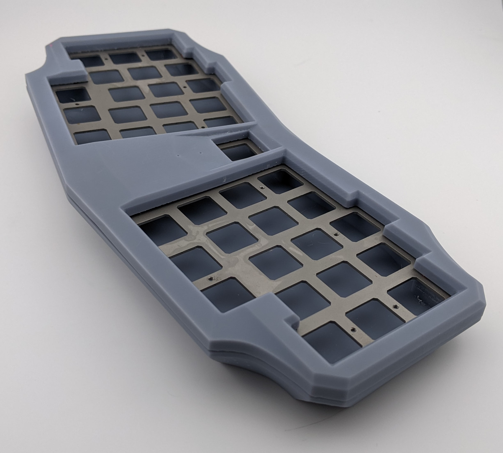

# "74"  The Negative Tilt Keyboard Case for Le Chiffre

(Photo Gracefully Provided by Swift)

Based on the work of [tominabox1](https://github.com/tominabox1/Le-Chiffre-Keyboard)
Negative 5 degree tilt for more ergo

STLs are provided, but if you wish to modify them you can edit the SCAD files. Additional Libraries needed are [Utility libraries](https://github.com/OskarLinde/scad-utils) and [BOSL2](https://github.com/BelfrySCAD/BOSL2)

This project is open sourced with the GPL-3.0 license. The license conditionally allows for commercial use, modification, distribution, patent, and private use. Please take note of the license conditions before utilizing this project.

## Parts
- 8x Acetal Dowel Pins 1/16" diameter, 1/4" long
- 16x O-Ring 1/16 Fractional Width Dash Number 003
- 16x 5x2mm Round Disc Magnets

## Instruction

- Print Top and Bottom
- Glue magnets and insert dowel pins.
- Sandwitch the PCB/Plate and O-rings
- Optional: Print Bottom Pattern and insert them.
- Voilà

